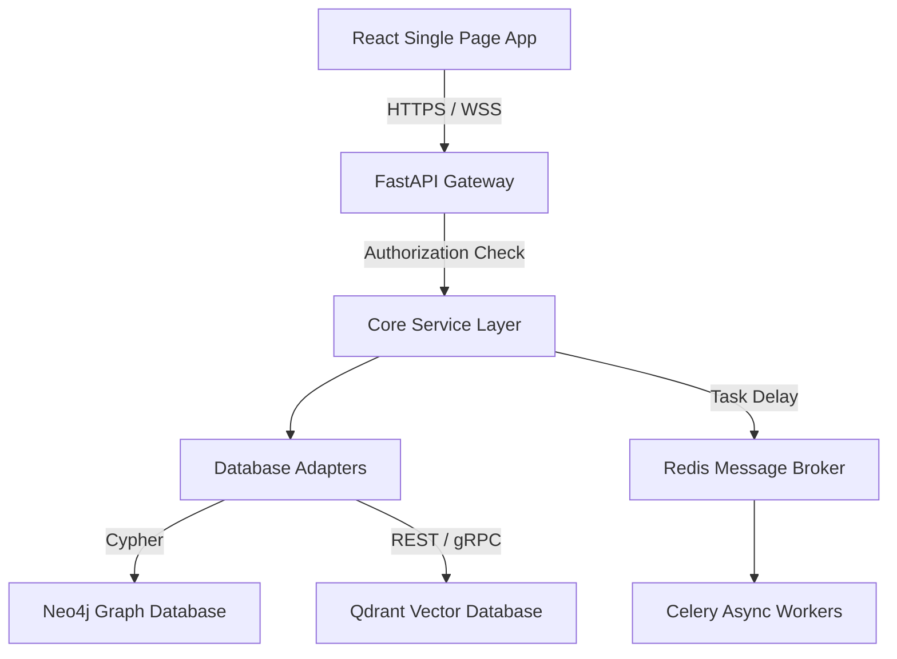

# Engineering Knowledge

This document provides a comprehensive technical overview of DocSphere's (EKOS) architecture, services, databases, and engineering principles.

---

## 1. Architecture Overview
DocSphere follows a clean, modular **layered service architecture**:

### Subsystems:
* **API Gateway (`main.py`)**: Unified entrypoint using FastAPI with CORSMiddleware, exception handlers, authentication dependency injects, and routing.
* **Knowledge Engine**: Orchestrates semantic and vector queries over Neo4j and Qdrant.
* **Ingestion Pipeline**: Handles crawling (web, sitemap, recursive), audio transcription, and file parsing.
* **Workflow Engine**: Redis-backed Celery worker processing for background tasks.
* **Security & Isolation**: JWT token decoder, API key check, tenant token verification, input validator, audit logger, and CMEK wrapper.

---

## 2. Subsystems & Key Code Files
* **API Gateway**: [`main.py`](file:///c:/Users/rajaj/Projects/DocSphere/backend/main.py)
* **Neo4j Production Adapter**: [`neo4j_adapter.py`](file:///c:/Users/rajaj/Projects/DocSphere/backend/services/knowledge_engine/neo4j_adapter.py)
* **Qdrant Vector Adapter**: [`qdrant_adapter.py`](file:///c:/Users/rajaj/Projects/DocSphere/backend/services/knowledge_engine/qdrant_adapter.py)
* **Celery Background Workers**: [`celery_app.py`](file:///c:/Users/rajaj/Projects/DocSphere/backend/services/workflow_engine/celery_app.py)
* **CMEK Encryption Layer**: [`encryption.py`](file:///c:/Users/rajaj/Projects/DocSphere/backend/shared/security/encryption.py)
* **Tenant Isolation Middleware**: [`tenant_isolation.py`](file:///c:/Users/rajaj/Projects/DocSphere/backend/shared/security/tenant_isolation.py)
* **API Key Manager**: [`api_key_manager.py`](file:///c:/Users/rajaj/Projects/DocSphere/backend/shared/security/api_key_manager.py)
* **Input Sanitizer**: [`input_validator.py`](file:///c:/Users/rajaj/Projects/DocSphere/backend/shared/security/input_validator.py)
* **React SPA Router**: [`App.tsx`](file:///c:/Users/rajaj/Projects/DocSphere/frontend/src/App.tsx)
* **Interactive Three-panel Layout**: [`project-workspace.tsx`](file:///c:/Users/rajaj/Projects/DocSphere/frontend/workspace/project-workspace.tsx)

---

## 3. Databases & Data Residency
* **Neo4j Graph Database**: Manages nodes (`Requirement`, `Capability`, `SystemParameter`, `Tenant`) and semantic edges (`IMPLEMENTS`, `TRAVERSES`, `DEPENDS_ON`).
* **Qdrant Vector Database**: Indexes requirement chunk embeddings (synthetic bag-of-words 384-dimensional cosine similarity vectors during fallback, OpenAI/local embeddings in production) for RAG context extraction.
* **Data Residency & CMEK**: Sensitive payload fields are encrypted with AES-256-GCM envelope encryption before entering the databases. Tenant ID is verified on every request to prevent cross-tenant exposure.
* **Orchestration Healthchecks**: Docker-compose uses healthcheck blocks to guarantee postgres, neo4j, qdrant, and redis are completely functional before uvicorn boots.

---

## 4. Zero-Trust Access & Security Gates
* **JWT Bearer Verification**: Enforces signature checks using HMAC-SHA256 of `EKOS_JWT_SECRET` (or `EKOS_MASTER_KEY`). Expired tokens are rejected automatically.
* **Input Security Validation**: Runs regex analysis on string arguments, preventing script injections (XSS), SQL Injections, and relative Path Traversals (`../`).
* **Role-Based Authorization (RBAC)**: Validates required permissions on sensitive endpoints:
  * `Admin`: Create/list keys, export analytics, revoke share links.
  * `Steward`: Register tools, read analytics summaries.
  * `Author`: Execute queries, submit feedback, export threads.

---

## 5. Automated Testing & Observability
* **Testing Stack**: pytest for Python backend unit, integration, concurrency, security, and boundary checks. Playwright for WCAG accessibility, visual regression, performance budget, and E2E integration tests.
* **Observability**: Tracing middleware tracks request latency. Prometheus metrics capture performance counts. Deep health checks monitor memory, CPU, and DB adapter status.
