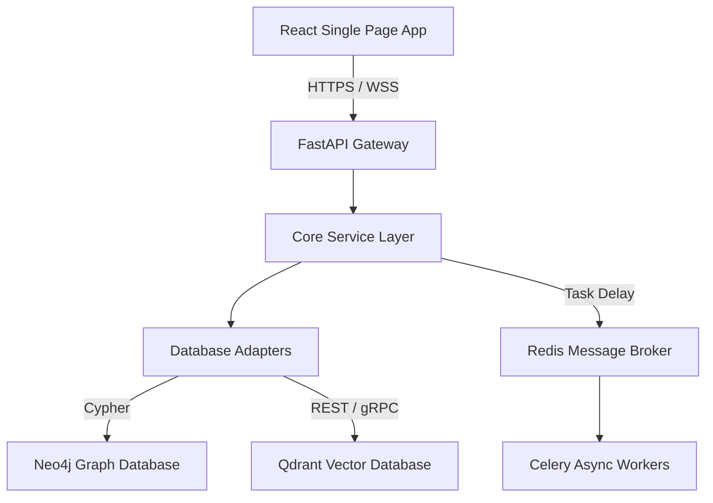

# Engineering Knowledge

This document provides a comprehensive technical overview of DocSphere's (EKOS) architecture, services, databases, and engineering principles.

---

## 1. Architecture Overview
DocSphere follows a clean, modular **layered service architecture**:

### Subsystems:
* **API Gateway (`main.py`)**: Unified entrypoint using FastAPI with CORSMiddleware, exception handlers, and routing.
* **Knowledge Engine**: Orchestrates semantic and vector queries over Neo4j and Qdrant.
* **Ingestion Pipeline**: Handles crawling (web, sitemap, recursive), audio transcription, and file parsing.
* **Workflow Engine**: Redis-backed Celery worker processing for background tasks.
* **Security & Isolation**: API key check, tenant token verification, audit logger, and CMEK wrapper.

---

## 2. Subsystems & Key Code Files
* **API Gateway**: [`main.py`](file:///c:/Users/rajaj/Projects/DocSphere/backend/main.py)
* **Neo4j Production Adapter**: [`neo4j_adapter.py`](file:///c:/Users/rajaj/Projects/DocSphere/backend/services/knowledge_engine/neo4j_adapter.py)
* **Qdrant Vector Adapter**: [`qdrant_adapter.py`](file:///c:/Users/rajaj/Projects/DocSphere/backend/services/knowledge_engine/qdrant_adapter.py)
* **Celery Background Workers**: [`celery_app.py`](file:///c:/Users/rajaj/Projects/DocSphere/backend/services/workflow_engine/celery_app.py)
* **CMEK Encryption Layer**: [`encryption.py`](file:///c:/Users/rajaj/Projects/DocSphere/backend/shared/security/encryption.py)
* **Tenant Isolation Middleware**: [`tenant_isolation.py`](file:///c:/Users/rajaj/Projects/DocSphere/backend/shared/security/tenant_isolation.py)
* **API Key Manager**: [`api_key_manager.py`](file:///c:/Users/rajaj/Projects/DocSphere/backend/shared/security/api_key_manager.py)
* **React SPA Router**: [`App.tsx`](file:///c:/Users/rajaj/Projects/DocSphere/frontend/src/App.tsx)
* **Interactive Three-panel Layout**: [`project-workspace.tsx`](file:///c:/Users/rajaj/Projects/DocSphere/frontend/workspace/project-workspace.tsx)

---

## 3. Databases & Data Residency
* **Neo4j Graph Database**: Manages nodes (`Requirement`, `Capability`, `SystemParameter`, `Tenant`) and semantic edges (`IMPLEMENTS`, `TRAVERSES`, `DEPENDS_ON`).
* **Qdrant Vector Database**: Indexes requirement chunk embeddings (synthetic bag-of-words 384-dimensional cosine similarity vectors during fallback, OpenAI/local embeddings in production) for RAG context extraction.
* **Data Residency & CMEK**: Sensitive payload fields are encrypted with AES-256-GCM envelope encryption before entering the databases. Tenant ID is verified on every request to prevent cross-tenant exposure.

---

## 4. In-Memory Fallback Logic
For local development, automated testing, and CI/CD pipelines:
* If Neo4j or Qdrant connections fail, adapters gracefully switch to local in-memory fallback indexes (`dict` and `list`).
* If Redis/Celery connections fail, background tasks execute in-memory asynchronously using `asyncio.create_task`.
* This ensures that unit tests run with **zero external dependencies** while maintaining absolute API signature fidelity.

---

## 5. Automated Testing & Observability
* **Testing Stack**: pytest for Python backend unit and integration tests. Playwright for WCAG accessibility, visual regression, performance budget, and E2E integration tests.
* **Observability**: Tracing middleware tracks request latency. Prometheus metrics capture performance counts. Deep health checks monitor memory, CPU, and DB adapter status.
